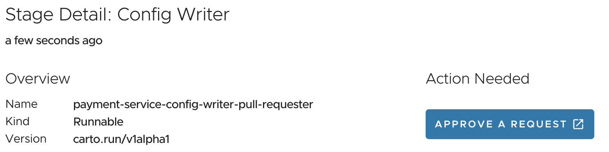

##### Image Provider

To be able to get all the benefits for our application Kubernetes provides, we have to containerize it.

The most obvious way to do this, is to write a Dockerfile, run `docker build` and push it to the container registry of our choice via `docker push`.


As you can see, in general it is relatively easy and requires little effort to containerize an application, but whether you should go into production with it, is another question, because it is hard to create an optimized and secure container image (or Dockerfile).

To improve the container image creation, **Buildpacks** were conceived by Heroku in 2011. Since then, they have been adopted by Cloud Foundry and other PaaS.
The new generation of buildpacks, the [Cloud Native Buildpacks](https://buildpacks.io), is an incubating project in the CNCF which was initiated by Pivotal (now part of VMware) and Heroku in 2018.

Cloud Native Buildpacks (CNBs) detect what is needed to compile and run an application based on the application's source code. 
The application is then compiled and packaged in a container image with best practices in mind by the appropriate buildpack.

The biggest benefits of CNBs are increased security, minimized risk, and increased developer productivity because they don't need to care much about the details of how to build a container.

With all the benefits of Cloud Native Buildpacks, one of the **biggest challenges with container images still is to keep the operating system, used libraries, etc. up-to-date** in order to minimize attack vectors by CVEs.

With **VMware Tanzu Build Service (TBS)**, which is part of TAP and based on the open source [kpack](https://github.com/pivotal/kpack), it's possible **automatically recreate and push an updated container image to the target registry, if there is a new version of the buildpack or the base operating system available** (e.g. due to a CVE).
With our Supply Chain, it's then possible to deploy security patches automatically.

In the details of the Image Provider step in **TAP-GUI**, you're able to see the **logs of the container build and the tag of the produced image**.
It also shows the reason for an image build. In this case it's due to our configuration change. As mentioned image builds can be also triggered if new operating system or buildpack versions are available.
This shows another time the benefit of Cartographer's asynchonous behavior.

Let's have a closer look at the resources running in the cluster.
The custom `Image` resource provides all configuration required for TBS to build and maintain a container image utilizing Cloud Native Buildpacks.
```execute
kubectl eksporter image.kpack.io
```

It references a **(Cluster)Builder** resource which allows granular control of how stacks of base images, buildpacks, and buildpack versions are utilized and updated.
```execute
kubectl eksporter clusterbuilder default
```

There is also the [kp CLI](https://github.com/vmware-tanzu/kpack-cli) available for more human friendly output which you can try in the workshop environment. 
Here are some sample commands and you can also trigger a new build via `kp trigger image payment-service` with the right priviledges.
```execute
kp image list
```
```execute
kp image status payment-service
```
```execute
kp build list payment-service
```

###### Container signing

TAP also provides optional container signing capabilites. **VMware Tanzu Build Service is able to sign containers** and the **Policy Controller** is a Kubernetes Admission Controller that allows operators to apply policies to verify signatures on container images before being admitted to a cluster.

The OSS used for this functionality is [cosign](https://docs.sigstore.dev/cosign/overview/).

###### Dockerfile-based builds

For those few use-cases no buildpack is yet available and the effort to build a custom one is to high, it's also possible to build a container based on a Dockerfile with TAP. Developer's have to specify the following parameter in their Workload configuration where the value references the path of the Dockerfile.
```
apiVersion: carto.run/v1alpha1
kind: Workload
...
spec:
  params:
  - name: dockerfile
    value: ./Dockerfile
...
```
For the building of container images from a Dockerfile without the need for running Docker inside a container, TAP uses the open-source tool [kaniko](https://github.com/GoogleContainerTools/kaniko).

##### Image Scanner

If you **have a closer look at the Image Scanner step in TAP-GUI** you can see that **different CVEs where found than with the source scanning**. 
There are several reason for that:
- The **container image includes the full stack** required to run the application. In this case the application, Tomcat application server, Java runtime environment, operating system, and additonal tools. 
- The container image also **includes all the dependencies** required to run the application. To reduce disc space and network traffic, those will usually not be committed to the version control system together with the sourcecode and instead defined in dependency management tools like Maven or npm and downloaded during the build process. Most of the **CVE scanners don't download the dependencies** for sourcecode scans, **which leds often to false positives or missed CVEs**, as they only compare what's defined in the definition file of the used dependency management tools (e.g. pom.xml or package.json) with CVE databases. Therefore, they are for example not aware of nested dependencies.

You may ask yourself whether there is still a value in source scans. The answer is yes, as **shifting security left in the path to production improves the productivity of developers**.

Due to the false positives it makes sense to have **different scan policies for source scanning and image scanning** which is supported by VMware Tanzu Application Platform but not implemented for this workshop.

Let's first another time **change our scan policy for demo purposes** to see our application running through the rest of the path to production and then have another look at the SBoM which should now include information about the full container stack.

```editor:select-matching-text
file: ~/samples/scan-policy.yaml
text: 'notAllowedSeverities := ["Critical", "High", "UnknownSeverity"]'
```

```editor:replace-text-selection
file: ~/samples/scan-policy.yaml
text: 'notAllowedSeverities := ["UnknownSeverity"]'
```
**Run the following command to apply the updated scan policy.**
```execute
kubectl apply -f ~/samples/scan-policy.yaml
```
If you **go back to TAP-GUI**, you should see that the **status of the source and image scan will change** and the container image will be passed to the next step.

###### Software bills of materials of the container image
Run the following command to get a human readable output of the SBoM.
```terminal:execute
command: |
  IMAGE_DIGEST=$(kubectl get imagescan payment-service -o jsonpath='{.spec.registry.image}'  | awk -F @ '{ print $2 }')
  tanzu insight image get --digest $IMAGE_DIGEST
clear: true
```
We can also change the **output format to common SBoM standards** like **SPDX and CycloneDX** which can be then used by tools that support them. 
SPDX defines more granular relationships between elements, which makes it more expressive but also more complex to define and work with.
```terminal:execute
command: tanzu insight image get --digest $IMAGE_DIGEST --output-format cyclonedx-xml
clear: true
```
```execute
tanzu insight image get --digest $IMAGE_DIGEST --output-format spdx-json
```

##### Config Provider, App Config, Service Bindings, Api Descriptors 

The steps between "Image Scanner" and "Config Writer" in the supply chain generate the YAML of all the Kubernetes resource required to run the application.

###### Config Provider

The Config Provider step uses the **Cartographer Conventions** component to provide a means for operators to express their knowledge about how applications can run on Kubernetes as a convention. It supports defining and applying conventions to pods. 

You can **define conventions** to target workloads by **using container image metadata**.
Conventions can use this information to only apply changes to the configuration of workloads when they match specific criteria (for example, Spring Boot or .Net apps, or Spring Boot v2.3+). Targeted conventions can ensure uniformity across specific workload types deployed on the cluster.

Conventions **can also be defined** to apply to workloads **without targeting container image metadata**. Examples of possible uses of this type of convention include appending a logging/metrics sidecar, adding environment variables, or adding cached volumes. 

With the current version on TAP, the following **out of the box conventions** are available with more to come in future versions.
```terminal:execute
command: kubectl get ClusterPodConvention
clear: true
```
- **Developer conventions** is a set of conventions that enable workloads to support live-update and debug operations
- **Spring Boot conventions** are smaller conventions applied to any Spring Boot application submitted to the supply chain. Most them either modify or add properties to the environment variable `JAVA_TOOL_OPTIONS` like for example to configure graceful shutdown and the default port to 8080 
- **Application Live View conventions** help to identify pods that are enabled for Application Live View. The metadata labels also tell the Application Live View connector what kind of app it is, and on which port the actuators are accessible for Application Live View.

The conditional criteria governing the application of a convention is customizable and can be based on the evaluation of a custom Kubernetes resource called **PodIntent**.
```terminal:execute
command: kubectl get PodIntent -o yaml | less
clear: true
```
**Press 'q' end quit less**.
In `.status.template.spec` you can see information about the generated Pod spec. The `conventions.carto.run/applied-conventions` annotation in `.status.template.metadata.annotation` lists all the applied conventions.

You can also see the first few lines of the Pod spec by clicking on the rectangle for the output next to the step in TAP-GUI. Not being able to see the full spec is currently a limitation of the Kubernetes' maximum status size.

###### App Config

The App Config step **uses the Pod spec** generated by Cartographer Conventions **for the generation of  YAML for deployment resources**. In the case of a **Workload of type web** this will be a **Knative Service** which you can see in TAP-GUI in the rectangle for the output of the step. More information on Knative will be provided in the next section.
For **other types of workloads** that for example don't provide an HTTP endpoint, the generated resources are for example a **Kubernetes Deployment and a Service**.

We can have a look at the full generated YAML in a ConfigMap where it will be stored to be transfered to the next step.
```terminal:execute
command: kubectl get configmap payment-service -o yaml | less
clear: true
```

###### Service Bindings, Api Descriptors 
Both steps generate additonal resources in YAML format for Service Bindings, which we will cover in the next section, and auto registration of API documentation in TAP-GUI.

```terminal:execute
command: kubectl get configmap payment-service-with-claims -o yaml | less
clear: true
```
```terminal:execute
command: kubectl get configmap payment-service-with-api-descriptors -o yaml | less
clear: true
```
##### Config Writer 
After generating the YAML of all the Kubernetes resource required to run the application, it's time to apply them to a cluster. Usually there is more than one cluster the application should run on, for example on a test cluster before production.

The Config Writer is responsible for writing the YAML files either to a Git repository for **GitOps** or as an alternative packaging them in a container image and pushing it to a container registry for **RegistryOps**.

**The workshop environment is configured for GitOps.**
In **detail view of the Config Writer step in TAP-GUI**, click on the **approve pull request button** that was auto-created by TAP to merge the changes to a in the configuration specified branch of the GitOps repositorys. 


In this case the **Git branches are used for staging** and we are directly merging in the prod branch.
For demo purpose, this pull request was auto approved and merged.

##### Delivery
With the deployment configuration of our application available in a Git repository, we are now able to deploy it automatically to a fleet of clusters on every change. There are several tools for this job available, like ArgoCD or Carvel's kapp-controller.

**Cartographer** also **provides a way to define a continuous delivery workflow** resource on the target cluster which e.g. picks up that configuration from the Git repository deploys it and runs some automated integration tests which is called **ClusterDelivery**.

A ClusterDelivery is analogous to SupplyChain, in that it specifies a list of resources that are created when requested by the developer. Early resources in the delivery are expected to configure the k8s environment (for example, by deploying an application). Later resources validate the environment is healthy. A **ClusterDeploymentTemplate** indicates how the ClusterDelivery should configure the environment. A **Deliverable** is the interface for the operator to pass information about the configuration to be applied to the environment to the ClusterDelivery.

For the sake of simplicity, our applcation is deployed to the same cluster we used for building it. 
Let's fist have a look at the Deliverable which is in this case automatically created and applied to the cluster.
```terminal:execute
command: kubectl eksporter deliverable --keep metadata.labels
clear: true
```
As you can see, it looks similar to a workload. Instead of the Git repository of the sourcecode, it references the GitOps repository. You may also assume that the `app.tanzu.vmware.com/deliverable-type: web` will be used as a selector for the ClusterDelivery.

```terminal:execute
command: kubectl eksporter clusterdelivery delivery-basic > ~/exports/delivery.yaml
clear: true
```
```editor:open-file
file: ~/exports/delivery.yaml
```
As you can see, the configuration of the ClusterDeliveries looks similar to ClusterSupplychain. You can specify the type of Deliverable they accept through the `spec.selector`, `spec.selectorMatchExpressions`, and `selectorMatchFields` fields and all of the resources via `spec.resources`.

ClusterSourceTemplates and ClusterTemplates are valid for ClusterDelivery. It additionally has the resource ClusterDeploymentTemplate. 
```terminal:execute
command: kubectl eksporter clusterdeploymenttemplate app-deploy
clear: true
```

With the **OOTB Delivery of TAP**, the GitOps repository will be watched for changes with the **Flux Source Controller** and the provided source code will be applied via **kapp-controller**.
**kapp-controller** could be also used to directly fetch and apply the contents of the GitOps repository but the this implementation should make it easy to add additional steps to the ClusterDelivery.
