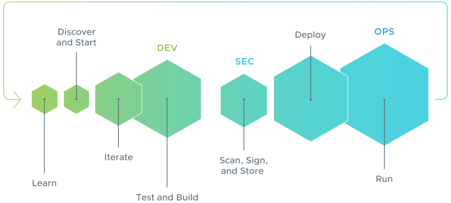
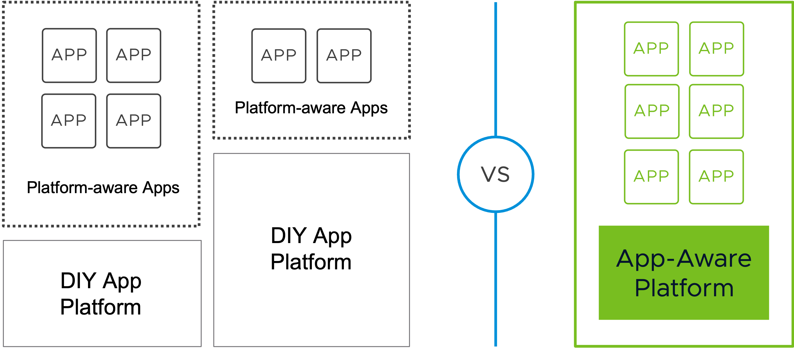

**VMware Tanzu Application Platform** (informally known as TAP) provides development teams a pre-paved path to production to get code running on any compliant public cloud or on-premises Kubernetes cluster, enabling security and scale.

It is an **application-aware platform** that abstracts away all platform and infrastructure specifics 
and gives development teams an interface where they only have to define the requirements of the applications they want to deplrun on the platform. 

TAP is **modular** so you can customize it based on you organization’s preferences.